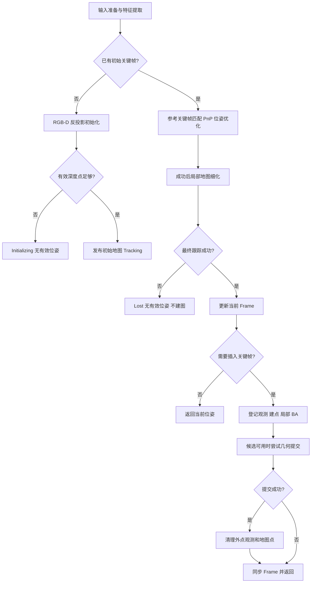

# RGB-D 初始化与连续跟踪学习笔记

整理日期：2026-09-15。本文根据学习作业及讨论修订，以当前 `visual_slam_cpp` 实现为主。第一部分用于复习流程，第二部分通过数学公式和实际代码解释原因。单目两帧初始化只作为对照，不是当前 C++ 的初始化入口。

源码片段按阅读需要重新排版，部分只摘录关键语句，不能作为独立程序直接编译。片段所在函数和链接指出其上下文；未展示的输入检查、失败处理等仍以源码为准。文中的参数是当前默认值，运行时可能被配置覆盖。

## 第一部分：文字笔记

### 1. 先认识系统中的数据

| 数据结构 | 记录什么 | 在流程中的角色 |
| --- | --- | --- |
| FrameInput | 图像、深度、时间戳、单位与对齐声明 | 外部输入 |
| FeatureSet | 关键点、描述子、每个关键点的可选深度 | 一帧的图像测量 |
| Frame | 输入身份、时间、特征、可选位姿、点关联 | 当前帧的临时估计 |
| KeyFrame | 源帧信息、特征、位姿、关联与观测 ID | 地图中保留的关键视角 |
| MapPoint | 世界三维坐标、代表描述子、观测索引 | 可被多个关键帧观察的地标 |
| Observation | 一个关键帧中的一个特征对一个地图点的测量 | 连接关键帧和地图点的边 |
| Map | 关键帧、地图点、观测及一致性维护 | 持久地图的拥有者 |

ORB 提取的是“关键点和描述子”，不要写成线性代数意义的“特征值”。关键点说明在哪里，描述子帮助判断两个局部区域是否相似。时间戳保存在 Frame/KeyFrame 中；当前 MapPoint 没有时间戳字段。

### 2. RGB-D 单帧初始化

1. **准备并检查输入。** 输入彩色图、对齐到彩色图的深度、相机内参和时间戳。图像必须已经校正，深度必须是彩色相机坐标系的 Z 值。将深度统一转换为米。
2. **提取特征并采样深度。** ORB 提取关键点和描述子，再在每个关键点附近采样有效深度。没有有效深度的特征仍可保留，但不参与创建初始地图点。
3. **反投影。** 用关键点像素、相机内参和 Z 深度得到相机坐标下的三维点。数量不足时等待后续帧重新尝试，默认需要至少 100 个点。
4. **定义世界坐标系。** 第一帧成功初始化的相机坐标系就是世界坐标系，将 Tcw 设为单位变换，因此这一帧的 Pc 等于 Pw。这是在选择坐标系，不是在测量外部世界中的绝对位置。
5. **创建候选地图。** 创建尚未发布的 Map，添加具有世界坐标和描述子的 MapPoint，并在当前帧副本中记录“特征下标 → MapPoint ID”。
6. **创建关键帧与观测。** 将副本提升为 KeyFrame，由 Map 为已关联的特征登记 Observation。初始地图点可以只有一条观测。
7. **完成初始化。** 保护初始关键帧不被删除，将候选地图交给 SlamSystem，系统进入 Tracking。保护不被删除与优化时固定其位姿是不同规则。

单目初始化需要从两个视角恢复未知结构；RGB-D 利用已测深度，可以用一个合格的视角直接建点。当前 RGB-D 初始化不需要 KNN 匹配、Essential Matrix 或两视图三角化。

### 3. 初始化后的连续跟踪

1. **准备当前帧。** 校验输入，提取 ORB 特征并采样深度。必须先有描述子，才能匹配。
2. **匹配参考关键帧。** 当前实现参考最后插入的关键帧，不一定参考上一普通帧。用描述子匹配找到对应特征。
3. **建立三维到二维对应。** 通过参考关键帧的特征关联找到已有 MapPoint，形成“世界三维坐标 Pw ↔ 当前像素 uv”。汉明距离比较 ORB 描述子，不比较 XYZ。
4. **PnP RANSAC 估计位姿。** 从已有三维点与当前二维测量估计 Tcw，并筛选内点。此处不需要重新求本质矩阵。
5. **单帧位姿优化。** 固定地图点坐标，调整当前位姿，使预测像素及可用深度接近测量。筛选后的内点数量足够才成功。
6. **局部地图细化。** 根据共视关系选择已有关键帧邻居，收集局部地图点，投影到当前图像，匹配并检查投影距离，再进行一次位姿优化。
7. **接受跟踪结果。** 最终成功后，将位姿和内点关联写入当前 Frame；失败则进入 Lost，不发布有效位姿，不建图。后续帧仍尝试对最后关键帧跟踪。

当前帧的某个特征没有深度，不一定不能参与跟踪：它仍可能与已有三维点形成 PnP 和像素优化约束。跟踪阶段也不需要先把当前帧所有特征反投影为一套三维点。

### 4. 关键帧选择

跟踪成功后，判断当前帧是否应成为关键帧。默认规则：

- 与上次关键帧的内部顺序间隔小于 2，不插入。
- 间隔达到 5，插入。
- 间隔处于两者之间，若平移至少 0.05 米、旋转至少 5 度，或当前跟踪内点少于 30，则插入。

这不是从多帧中通过点投票挑一个“最佳帧”。共享点计数用于 `SelectNeighbors()` 选择已有局部邻居；`ShouldInsert()` 判断是否将当前帧加入地图，两者职责不同。内点数量也不等于整张地图的地图点数量。

### 5. 局部建图

1. 将当前 Frame 插入 Map 成为 KeyFrame，并登记已跟踪到的持久 Observation。
2. 选择邻居关键帧，与新关键帧匹配。
3. 匹配的一端已有地图点时，几何检查通过后给另一端补充观测。
4. 两端都没有地图点时，依次尝试新关键帧深度、邻居深度，再尝试两视图三角化。
5. 剩余未关联的有效深度特征也可以建立单视图地图点。
6. 构建局部 BA 问题，求解并检查是否可提交。

当前没有地图点融合；若匹配两端已有点，不自动合并两个点 ID。默认每次插帧最多新建 400 个点。

Map 负责安全修改实体及索引，LocalMapper 负责何时插帧、建点、组织优化和清理。

### 6. 局部 BA、清理和同步

1. 收集多个局部关键帧、地图点和 Observation，形成独立数值问题。保留必要的固定参考和外部边界位姿。
2. 联合优化局部可变关键帧位姿与地图点坐标，使重投影误差及可用深度误差减小。
3. 求解结果通过收敛、数值、代价和约束图检查后，再由 Map 检查 epoch/revision 并提交几何。
4. BA 提交成功后，删除其外点观测，并清理 bad 点、无观测点、观察期已过但观测仍不足的点。
5. 将新关键帧的最终位姿和关联同步回当前 Frame，再返回单帧结果。

本帧看不到一个地图点不意味着它应被删除。点观察期按关键帧插入次数计算，默认是 3 次；少于两条观测指持久 Observation 数量。BA 拒绝不撤销本次已插入的关键帧和新点，但不会提交被拒绝的候选几何，也不执行依赖该次提交的清理。

### 7. 整个循环的含义

```text
已有地图 → 帮助当前帧定位
定位成功 → 判断是否需要新关键帧
需要插帧 → 扩展、优化和维护地图
更新后的地图 → 帮助后续帧定位
```

每帧都尝试定位，并非每帧都会修改持久地图。不插关键帧时，主要更新的是临时 Frame。RGB-D 深度提供米制尺度，但不会自动消除漂移；当前系统仍不包含闭环、全局位姿图优化或数据库重定位。

## 第二部分：数学公式与项目代码详解

### 1. 坐标、位姿与深度约定

设世界点为 $P_w$，相机点为 $P_c$，像素为 $\mathbf{u}=(u,v)^T$。相机坐标 X 向右、Y 向下、Z 向前，空间距离单位为米。

$$
T_{cw}=\begin{bmatrix}R_{cw}&t_{cw}\\0&1\end{bmatrix},\qquad
P_c=R_{cw}P_w+t_{cw}
$$

`Tcw` 把世界点变换到相机坐标；`Twc` 是它的逆：

$$
R_{wc}=R_{cw}^{T},\qquad
 t_{wc}=-R_{cw}^{T}t_{cw},\qquad
 P_w=R_{wc}P_c+t_{wc}
$$

相机在世界中的位置是 $C_w=t_{wc}$，不是 $t_{cw}$。读 [SE3](../include/vslam/geometry/se3.h) 时，将 `tcw * point_w` 对应到第一条公式，将 `tcw.Inverse() * point_c` 对应到第二条公式。

相机内参：

$$
K=\begin{bmatrix}f_x&0&c_x\\0&f_y&c_y\\0&0&1\end{bmatrix}
$$

投影与反投影：

$$
\pi(P_c)=\begin{bmatrix}f_xX/Z+c_x\\f_yY/Z+c_y\end{bmatrix},\qquad
P_c=ZK^{-1}\begin{bmatrix}u\\v\\1\end{bmatrix}
$$

这里 Z 是沿相机光轴的深度，不是欧氏距离 $\sqrt{X^2+Y^2+Z^2}$。尺寸相同也不能证明 RGB 与深度已注册到相同网格。

例如 $f_x=f_y=500$，$(c_x,c_y)=(320,240)$，像素 $(370,240)$、Z=2 米，得到 $P_c=(0.2,0,2)$ 米。

### 2. 从输入到带深度的特征

原始深度单位换算：

$$
Z_{\mathrm m}=s\,d_{\mathrm{raw}}
$$

毫米输入的 $s=0.001$，已经是米的输入 $s=1$。在 [image_preprocessor.cpp](../src/sensor/image_preprocessor.cpp) 中只做一次单位转换：

```cpp
input.depth.convertTo(output.depth_z_m, CV_32F, input.meters_per_depth_unit);
```

`Prepare()` 还校验输入声明、尺寸与类型，复制图像或转换 BGR→RGB。它不执行原生深度注册或去畸变；这些是输入先决条件。

[features.cpp](../src/frontend/features.cpp) 中，ORB 输出关键点和对应的描述子行：

```cpp
std::vector<cv::KeyPoint> points;
cv::Mat descriptors;
detector->detectAndCompute(gray, cv::noArray(), points, descriptors);

// Inside the keypoint conversion loop:
k.depth_z_m = sensor::SampleDepth(
    depth, k.uv, options_.min_depth, options_.max_depth,
    options_.depth_radius);
```

默认深度采样半径 1：以舍入后的像素为中心，在图像边界内收集最多 3×3 个深度值，只保留有限且在 0.2–8.0 米区间内的样本，再取中位数。偶数样本取中间两值的平均；没有样本返回空 optional。各算法复用这份每特征深度。

### 3. RGB-D 初始化：为什么一帧就够

已知 $(u,v,Z)$ 后，反投影直接给出三维点。[InitializeRGBD](../src/initialization/rgbd_initializer.cpp) 按特征收集候选：

```cpp
const auto& k = frame.features().at(i);
if (!k.depth_z_m || *k.depth_z_m < min_depth || *k.depth_z_m > max_depth) {
    continue;
}

const auto p = camera.Unproject(k.uv, *k.depth_z_m);
if (p) {
    candidates.push_back({i, *p});
}
```

候选项是 `pair<特征下标, 三维坐标>`。若数量不足则返回等待状态；足够时显式定义首帧位姿为单位变换：

```cpp
if (candidates.size() < min_points) {
    return result;
}

core::Frame staged(frame);
staged.SetPose(geometry::SE3());
```

此时 $T_{cw}=I$，所以 $P_w=P_c$。临时副本 staged 用于组装结果，候选 Map 由 unique_ptr 独占：

```cpp
auto map = std::make_unique<core::Map>(
    frame.features().kind(), frame.id().epoch());

for (const auto& item : candidates) {
    const auto id = map->AddMapPoint(
        item.second, frame.features().Descriptor(item.first));
    staged.Associate(item.first, id);
}

result.keyframe = map->InsertKeyFrame(staged);
map->ProtectKeyFrame(result.keyframe);
result.points = candidates.size();
result.map = std::move(map);
frame = std::move(staged);
```

`Associate()` 记录临时关联；`InsertKeyFrame()` 创建持久关键帧并登记这些关联对应的 Observation。初始化成功后，[SlamSystem::InitializeFrame](../src/system/slam_system.cpp) 接管该 Map：

```cpp
map_ = std::move(initialized.map);
last_keyframe_ = initialized.keyframe;
result.inserted_keyframe = initialized.keyframe;
state_ = SlamState::Tracking;
```

初始化器生成的地图就是后续运行地图，不再重新创建一套相同点。

### 4. 对照：单目两帧初始化为何不同

单目只有两帧二维测量，需要先匹配，再估计几何关系。在约定 $P_{c2}=RP_{c1}+t$ 下：

$$
E=[t]_\times R,\qquad \mathbf{x}_2^T E\mathbf{x}_1=0,\qquad
\mathbf{x}_i=K^{-1}[u_i,v_i,1]^T
$$

$[t]_\times$ 是满足 $[t]_\times a=t\times a$ 的 3×3 反对称矩阵。不是 $R^Tt$，后者是三维向量。

Python 原型先在 `VisualSLAM/slam/frontend/geometric_verification.py` 中调用 `cv2.findEssentialMat(..., method=cv2.RANSAC)`，再在 `VisualSLAM/slam/initialization/mono_initializer.py` 调用 `cv2.recoverPose()` 并归一化平移方向，最后以投影矩阵 $K[I|0]$ 与 $K[R|t]$ 三角化并检查正深度、视差和重投影误差。单目初始尺度未知。上述 Python 路径相对父工作区；它们不属于独立 C++ 仓库。

当前 C++ RGB-D 初始化直接反投影建点，因此不走 Essential Matrix 路径。后续局部建图仍可能使用两视图三角化，不能据此理解成系统完全没有三角化。

### 5. 描述子匹配与地图三维点之间的连接

对 ORB 二进制描述子 $a,b$，汉明距离是不同位的个数：

$$
d_H(a,b)=\operatorname{popcount}(a\oplus b)
$$

它比较外观编码，不比较三维位置。KNN 返回两个最近候选，距离分别为 $d_1,d_2$，ratio test 要求：

$$
d_1<\alpha d_2\quad (\alpha\text{ 默认 }0.75)
$$

来自 [FeatureMatcher::MatchDescriptors](../src/frontend/features.cpp)：

```cpp
cv::BFMatcher matcher(a.type() == CV_8UC1 ? cv::NORM_HAMMING : cv::NORM_L2);
matcher.knnMatch(a, b, forward, 2);

for (const auto& pair : forward) {
    if (pair.size() != 2 || pair[0].distance >= options_.ratio * pair[1].distance) {
        continue;
    }
    // Remaining checks and result assembly are omitted.
}
```

实现还支持反向一致性检查，并通过排序和去重限制当前特征的分配。SIFT 使用浮点描述子及 L2 距离，而非汉明距离。

[FrameTracker::Track](../src/tracking/frame_tracker.cpp) 的数据转换是跟踪最关键的一步：

```cpp
const auto matches = matcher_.MatchDescriptors(
    ref.features().descriptors(), frame.features().descriptors());

for (const auto& m : matches) {
    const auto id = ref.associations().at(m.first);
    if (!id.valid() || map.GetMapPoint(id).is_bad() || !used.insert(id).second) {
        continue;
    }

    const auto& p = map.GetMapPoint(id).position_w();
    const auto& q = frame.features().at(m.second).uv;
    xyz.emplace_back(p.x(), p.y(), p.z());
    uv.emplace_back(q.x(), q.y());
    associations.push_back({m.second, id});
}
```

| 表达式 | 含义 |
| --- | --- |
| `m.first` | 参考关键帧的特征下标 |
| `m.second` | 当前帧的特征下标 |
| `ref.associations()[m.first]` | 参考特征所关联的地图点 ID |
| `map.GetMapPoint(id).position_w()` | 已有地图点的世界坐标 |
| `frame.features().at(m.second).uv` | 当前帧对该点的像素测量 |

这形成 $(P_{w,i},\mathbf{u}_i)$ 数据对，随后求解的是当前位姿。

### 6. PnP RANSAC 与单帧位姿优化

PnP 利用相机投影关系：

$$
\mathbf{u}_i\approx\pi(R_{cw}P_{w,i}+t_{cw})
$$

已知地图点、测量像素和相机内参，估计 R、t。RANSAC 鲁棒估计位姿并筛选几何内点，不负责原始描述子匹配。

```cpp
const bool ok = cv::solvePnPRansac(
    xyz, uv, k, cv::noArray(), rvec, tvec, false,
    options_.pnp_iterations, static_cast<float>(options_.pnp_error),
    options_.pnp_confidence, inliers, cv::SOLVEPNP_EPNP);
```

当前默认 100 次迭代、4 像素阈值、置信度 0.99。之后将旋转向量转换为旋转矩阵，用 PnP 内点调用 `Optimize(frame, map, geometry::SE3(r,t), selected)`。

优化测量结构来自 [FrameTracker::Optimize](../src/tracking/frame_tracker.cpp)：

```cpp
measurements.push_back({
    map.GetMapPoint(a.point).position_w(), k.uv, k.depth_z_m});
result.optimization = optimizer_.Solve(initial, measurements);
```

每个观测的预测相机点为 $\hat P_{c,i}=RP_{w,i}+t$，残差为：

$$
r_i(T)=\begin{bmatrix}
(\hat u_i-u_i)/\sigma_{\mathrm{px}}\\
(\hat v_i-v_i)/\sigma_{\mathrm{px}}\\
(\hat Z_i-Z_i)/\sigma_Z
\end{bmatrix}
$$

没有深度时只保留前两个分量。当前求解器默认 $\sigma_{\mathrm{px}}=1$ 像素，$\sigma_Z=0.03$ 米；这是 SolverOptions 的权重配置，不等同于 Map::AddObservation 底层 API 的默认深度 sigma。

[solvers.cpp](../src/optimization/solvers.cpp) 中的实际残差计算：

```cpp
ceres::AngleAxisRotatePoint(pose, point, pc);
for (int i = 0; i < 3; ++i) {
    pc[i] += pose[i + 3];
}

r[0] = (T(fx) * pc[0] / pc[2] + T(cx) - T(u)) / T(pixel_sigma);
r[1] = (T(fy) * pc[1] / pc[2] + T(cy) - T(v)) / T(pixel_sigma);
if constexpr (N == 3) {
    r[2] = (pc[2] - T(z)) / T(depth_sigma);
}
```

`T` 在这里是自动求导使用的标量模板类型，不是位姿矩阵。Ceres 内部 pose 的前 3 项是 angle-axis 旋转向量，后 3 项是平移；对外仍使用 SE3/Tcw。

位姿优化的目标可表示为：

$$
\min_{T_{cw}}\ \frac12\sum_i\rho\bigl(r_i(T_{cw})^T r_i(T_{cw})\bigr)
$$

世界点固定，只优化当前姿态。实现对整条观测残差块使用 Huber 损失，减轻大残差影响；默认 Huber delta=2.5，配置为 0 则使用线性损失。默认至少 15 个最终优化内点才跟踪成功。

### 7. 局部地图细化与最终接受

在 [SlamSystem::TrackFrame](../src/system/slam_system.cpp) 中，先完成参考关键帧跟踪，再选邻居和局部点：

```cpp
auto tracked = tracker_.Track(
    frame, map_->GetKeyFrame(*last_keyframe_), *map_);

if (tracked.success) {
    auto local_keyframes = mapping::SelectNeighbors(
        *map_, *last_keyframe_, config_.mapping.max_neighbors);
    local_keyframes.push_back(*last_keyframe_);

    const auto local_points = mapping::CollectPoints(*map_, local_keyframes);
    tracked = tracker_.RefineLocal(frame, *map_, local_points, tracked);
}
```

共视权重可理解为参考关键帧与另一关键帧共享的有效地图点观测计数。实现按权重降序、相同权重按较新 ID 优先排序；候选中也可能包含零共视权重关键帧。CollectPoints 去重并排除 bad 点。

局部细化使用候选位姿投影地图点：

$$
\hat{\mathbf{u}}_j=\pi(T_{cw}P_{w,j}),\qquad
\|\hat{\mathbf{u}}_j-\mathbf{u}_{\mathrm{match}}\|_2\le r
$$

默认 $r=20$ 像素。实现先在选出的局部点集合中比较描述子，再按投影距离过滤，尚没有图像网格内匹配搜索。

```cpp
const auto uv = camera_.Project(*seed.tcw * p.position_w());
// Visibility and descriptor checks are omitted here.

if (used_features.count(m.second) ||
    (projections[m.first] - frame.features().at(m.second).uv).norm() >
        options_.search_radius) {
    continue;
}
```

把新关联合并到 seed 的内点中，再调用 Optimize。System 用这次细化结果替换 seed；细化失败时不会只凭前一轮候选发布成功。

```cpp
if (!tracked.success) {
    state_ = SlamState::Lost;
    frame.ClearPose();
    return;
}

frame.SetPose(*tracked.tcw);
for (const auto& association : tracked.associations) {
    frame.Associate(association.feature, association.point);
}
```

跟踪器接收只读 Frame 和 Map，先返回候选结果；最终成功时由 System 更新临时 Frame。此时尚未新增持久 Observation。

### 8. 关键帧选择的数学量

[ShouldInsert](../src/mapping/local_mapper.cpp) 计算内部间隔：

$$
\Delta n=n_{\mathrm{current}}-n_{\mathrm{last\ keyframe}}
$$

相机中心距离与相对旋转角：

$$
d=\|C_{w,\mathrm{current}}-C_{w,\mathrm{last}}\|_2
$$

$$
R_{\mathrm{rel}}=R_{cw,\mathrm{current}}R_{cw,\mathrm{last}}^T,\qquad
\theta=\arccos\left(\operatorname{clamp}\left(
\frac{\operatorname{tr}(R_{\mathrm{rel}})-1}{2},-1,1\right)\right)
$$

角度与配置比较前转换为度。clamp 避免数值舍入使 arccos 输入略微越界。代码使用逆位姿中的平移计算相机中心距离：

```cpp
const double translation =
    (frame.pose()->Inverse().translation() - last.pose().Inverse().translation()).norm();
```

通过最小/最大帧间隔门控后，再检查运动或内点条件。位姿必须有效，System 也只在跟踪成功分支调用该函数。

### 9. 插帧、观测与新点创建

一条观测表示 $O_{kj}=(K_k,P_j,i,\mathbf{u}_{ki},Z_{ki})$，其中 i 是关键帧内的特征下标，Z 可缺省。一个关键帧可有多条观测，一个地图点也可被多个关键帧观察。

```text
KeyFrame A 的特征 7 ── Observation O1 ── MapPoint P
KeyFrame B 的特征 3 ── Observation O2 ── MapPoint P
```

[Map::AddObservation](../src/core/map.cpp) 同时维护四处关系，实际代码还包含分配失败回滚：

```cpp
observations_.emplace(id, observation);
keyframe.observation_ids_.insert(id);
point.observations_.emplace(keyframe_id, id);
keyframe.associations_[feature] = point_id;
```

[LocalMapper::Process](../src/mapping/local_mapper.cpp) 通过 InsertKeyFrame 登记当前已跟踪关联，再通过 Extend 建点和传播观测：

```cpp
result.keyframe = map.InsertKeyFrame(frame);
const auto neighbors = SelectNeighbors(map, result.keyframe, options_.max_neighbors);
const auto created = Extend(map, result.keyframe, neighbors);
```

深度建点先反投影得到 Pc，再变换回世界：

$$
P_w=T_{cw}^{-1}\left(ZK^{-1}[u,v,1]^T\right)
$$

```cpp
const auto p = camera_.Unproject(feature.uv, *feature.depth_z_m);
return p ? std::optional<Eigen::Vector3d>(k.pose().Inverse() * *p)
         : std::nullopt;
```

这里第一个 `*` 是位姿对点的变换，第二个 `*p` 是取 optional 中的值。

如果两边都没有可用深度，Extend 尝试已知两关键帧位姿下的三角化。用归一化像素 $(x_i,y_i)$ 和投影矩阵 $P_i=[R_i|t_i]$ 构造：

$$
A=\begin{bmatrix}
x_1P_1^{(3)}-P_1^{(1)}\\
y_1P_1^{(3)}-P_1^{(2)}\\
x_2P_2^{(3)}-P_2^{(1)}\\
y_2P_2^{(3)}-P_2^{(2)}
\end{bmatrix},\qquad A\tilde P_w=0
$$

$P_i^{(r)}$ 表示第 r 行。通过 SVD 取最小奇异值对应的右奇异向量，再除以齐次分量得到三维点。实现默认要求至少 1 度视差、最多 3 像素重投影误差，并检查投影有效性和可用深度一致性。这里只使用已有位姿，不重新估计 Essential Matrix。

### 10. 局部 BA 的变量、目标和固定边界

局部 BA 的观测集合为 $\mathcal O$，可变关键帧集合为 $\mathcal K_v$，待优化点集合为 $\mathcal P$：

$$
\min_{\{T_k\}_{k\in\mathcal K_v},\{P_j\}_{j\in\mathcal P}}
\frac12\sum_{(k,j)\in\mathcal O}\rho\left(\|r_{kj}(T_k,P_j)\|^2\right)
$$

残差形式与单帧优化相同，但现在多个位姿和地图点都可改变。固定锚和外部边界位姿保持不变，不能将整张局部结构任意整体搬动。RGB-D 有效深度约束提供尺度支持。

| 对比 | 单帧位姿优化 | 局部 BA |
| --- | --- | --- |
| 位姿变量 | 当前一帧 | 多个局部关键帧中的可变部分 |
| 地图点变量 | 固定 | 所选点共同优化 |
| 测量 | 当前帧特征与已有地图点的关联 | 持久 Observation |
| 结果应用 | System 更新当前 Frame | Map 验证并提交批量几何 |

BuildProblem 复制 ID、位姿、三维点、像素和可选深度，生成不持有 Map 指针的数值问题。默认预算是 8 个局部关键帧、300 点、4000 观测和 32 个外部固定边界关键帧。只纳入至少两条有效观测的点，当前关键帧必须参与为可变位姿。

```cpp
result.ba = ba_.Solve(BuildProblem(map, result.keyframe));
```

在 [LocalBundleAdjuster::Solve](../src/optimization/solvers.cpp) 中固定指定相机参数块：

```cpp
if (p.poses[i].fixed) {
    problem.SetParameterBlockConstant(poses[i].data());
}
```

当前检查偏保守：需要有效固定深度锚，可变位姿有足够观测、每个优化点至少两个观测，并验证连通约束。接受还要求收敛、有限可用结果、同一残差集合上代价不增加及最终有效图。仅耗尽迭代次数不能授权提交。

### 11. 提交、清理和 Frame 同步

BAProblem 保存读取地图时的 epoch 与 revision。Map::CommitGeometry 先检查版本、ID 与数值，验证整批后才修改持久几何。它不负责判断求解器是否收敛。

```cpp
result.ba_committed = map.CommitGeometry(
    result.ba.geometry.epoch,
    result.ba.geometry.revision,
    poses, points).ok();
```

只有提交成功，才删除此次 BA 的外点观测并执行点清理。以下摘自 LocalMapper：

```cpp
if (point.is_bad() || point.observations().empty() ||
    (insertions_ - birth >= static_cast<std::uint64_t>(options_.point_grace_period) &&
     point.observations().size() < 2)) {
    map.RemoveMapPoint(p.id);
    births_.erase(p.id);
    ++result.removed_points;
}
```

这里不能改写成“当前帧跟丢的点都删除”：当前不可见与持久观测不足是不同条件。新增点登记失败还有单点回滚路径，这是异常安全机制，也不是跟丢清理。

最终同步包含位姿和关联两部分：

```cpp
const auto& key = map.GetKeyFrame(result.keyframe);
frame.SetPose(key.pose());

for (std::size_t i = 0; i < frame.features().size(); ++i) {
    frame.RemoveAssociation(i);
    if (key.associations()[i].valid()) {
        frame.Associate(i, key.associations()[i]);
    }
}
```

System 在 mapping 返回后读取 `frame.pose()` 放入 `result.tcw`，所以当前返回结果包含本次建图后接受的位姿修正。

### 12. 用状态和数据流检查自己的理解



图中提交未成功时跳过清理，但仍同步 Frame 后返回；输入/数值异常由 System 另行处理。调用者应检查 `result.status.ok() && result.tcw`，仅 state 为 Tracking 不足以证明本次输入有可用输出。

复习时用四个问题检查每个函数：它输入的是测量还是估计？三维点在哪个坐标系？它修改临时 Frame 还是持久 Map？失败后哪些修改已经发生？能回答这些问题，就能避免将初始化、跟踪、建图和 BA 混成一个步骤。

相关材料：[项目学习指南](project_learning_guide_cpp98.md)、[RGB-D 管线说明](experiment/rgbd_slam_pipeline.md)、[版本一验证报告](experiment/rgbd_drift_validation.md)。
